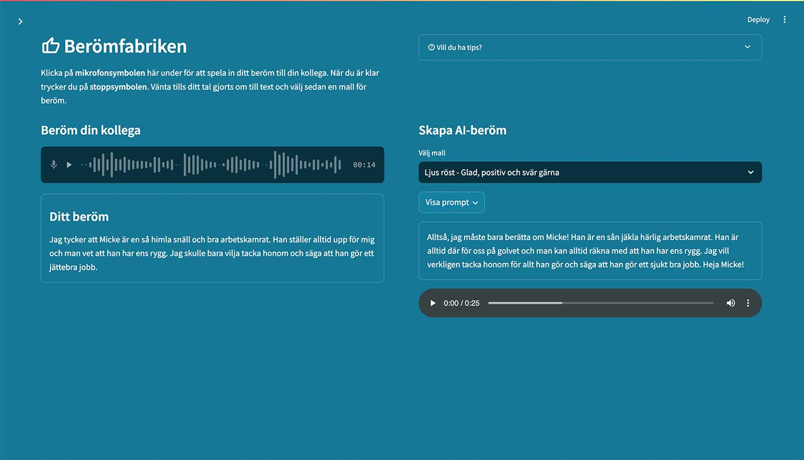

# Berömfabriken
Berömfabriken är av flera prototyper som togs fram inom projektet "Top of Mind: Jämställdhet i industrins vardag".  
Projektets sida hittar du på https://www.ri.se/sv/vad-vi-gor/projekt/top-of-mind-jamstalldhet-i-industrins-vardag

## Bakgrund
__Att ge beröm till en kollega kan kännas lite pinsamt, men forskning har visat att det kan få oss att må bättre på jobbet och 
att vi till och med blir mer produktiva. Att få höra att kollegor värdesätter och uppmärksammar en ökar ens välmående helt enkelt.__

Målet med Berömfabriken är att sänka trösklarna för att ge sina kollegor beröm. Det bästa berömet är givetvis det man ger 
människa till människa, men det är inte alla som vågar göra det. Det kan också kännas problematiskt att som man ge en kvinna 
en komplimang eller som medarbetare till sin chef.

Berömdrömmen är öppen 24/7, 365 dagar om året och du kan som medarbetare anynomt prata in ett beröm, som därefter görs om med 
generativ AI. 

I den bästa av världar leder Berömfabriken till att normalisera berömmandet av kollegor till den grad att den inte längre behövs.

## Hur funkar det?
Användaren går in på sidan och klickar på inspelning. När användaren spelat in sitt beröm så transkriberas berömmet med Whisper (OpenAI). 
Därefter kan användaren välja mellan ett antal olika mallar (personligheter) där GPT-4o (OpenAI) bearbetar den transkriberade texten 
och därefter skickar den till ElevenLabs, där texten görs om till tal. Till sist så mixas talet ihop tillsammans med AI-genererad 
bakgrundsmusik (Udio) och presenteras för användaren.



## Installation

Du behöver
- API-nyckel till OpenAI för Whisper och GPT-4o
- API-nyckel till ElevenLabs för tal

Det här är en Streamlit-app kodad i Python och vill du enkelt sätta upp detta för test online kan du följa den installationsguide som jag gjort 
för en annan app på https://github.com/mickekring/gen-ai-labb  
Skillnaden är att du vid steg 10 måste lägga till API-nyckeln för ElevenLabs. Pwd_on gör sidan lösenordsskyddad med det lösenord du sätter 
vid password.
```
openai_key = ""
elevenlabs_key = ""
pwd_on = "true"
password = "lösenord123"
```

Vill du ladda ned och köra appen lokalt, så får du skapa filen /.streamlit/secret.toml och lägga till API-nycklarna ovan i den filen.  
Installera allt i requirements.txt och kör appen med
```
streamlit run app.py
```

## Vad får jag göra med koden?
Du är fri att göra vad du vill med den. Inspireras, koda om, förbättra och sprid vidare... :)  
Du får också ha lite förbarmande av att koden kan vara av sisådär karaktär. Jag är bara en hobbykodare.

## En del av en automatiserad företagsradiokanal
Lite kuriosa är att denna prototyp skulle vara en del av en automatiserad radiokanal, skapad av AI, som lyfte in externa nyheter om företaget, interna nyheter från intranätet 
samt spelade musik från en gemensam spotify-lista som all personal kunde bidra till. Tyvärr så fanns det inte möjlighet att göra verklighet av det då projektet inte 
hade de resurserna.

